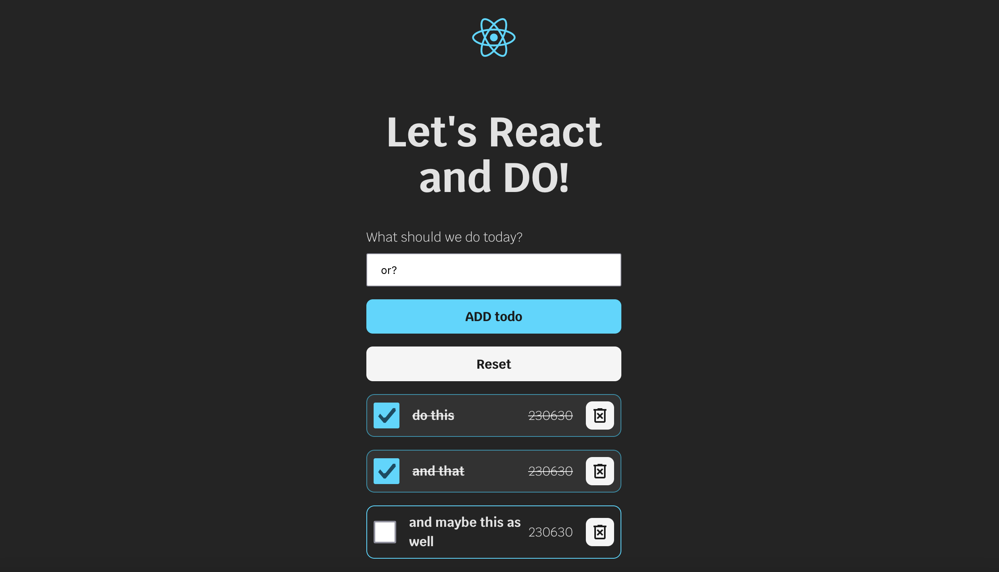

# learning-react

Trying to learn React so there will be some small projects in the makin'.  
here is a TodoList using Vite, React and Typescript. 
We have a form with inputfield, a submit button and a reset button 
When typing something and click add (or enter), the todo will be visible with a checkbox, the text the user wrote, deadline date (now hardcoded as 230630) and a remove button. 
You'll get a visible feedback when you check your checkbox, and you're able to remove the todo. 
  
future todo is to be able to choose a deadline date of your own choose, sort the list, and to save the list in localStorage.  

